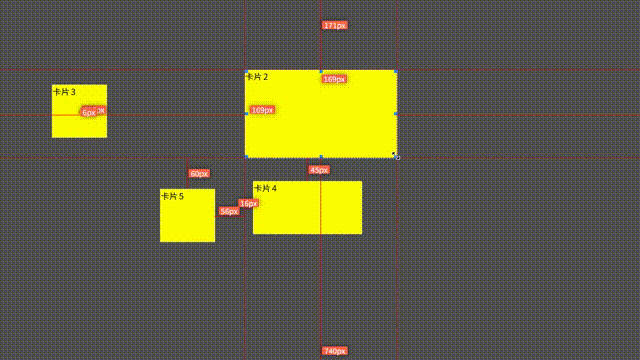

# vue3-drag-resize-plus

- 拖拽移动
- 调整大小
- 距离提示
- 磁吸
- 缩放适配



## install

```sh
npm install vue3-drag-resize-plus
# 或者
pnpm add vue3-drag-resize-plus
```

## usage

```html
<DragResizePlus
  :key="item.id"
  :id="item.id"
  :is-active="state.activeId === item.id"
  :unscale="unscale"
  :parent-width="state.screenWidth"
  :parent-height="state.screenHeight"
  v-for="item in state.elmts"
  :elmts="state.elmts"
  v-model:rect="item.rect"
  :isEdit="state.isEdit"
  :isNear="state.isNear"
  :nearStep="state.nearStep"
  :isGuideLine="state.isGuideLine"
  :guideDistance="state.guideDistance"
  @dragStart="onAction"
  @dragMove="onAction"
  @dragEnd="onAction"
  @resizeStart="onAction"
  @resizeMove="onAction"
  @resizeEnd="onAction"
  @click="onClick(item.id)"
  :points="state.points"
  >{{ item.title }}
</DragResizePlus>
```

```ts
import {computed, reactive} from 'vue';
import {DragResizePlus} from 'vue3-drag-resize-plus';
import 'vue3-drag-resize-plus/index.css';

const mockList: any[] = [];

for (let i = 0; i < 5; i++) {
  mockList.push({
    rect: {
      left: i * 100,
      top: i * 100,
      width: i % 2 ? 200 : 100,
      height: 100
    },
    id: i + 1,
    title: '卡片' + (i + 1)
  });
}
const state = reactive({
  screenWidth: 1920,
  screenHeight: 1080,
  elmts: mockList,
  scale: 1,
  isEdit: true,
  isNear: true,

  nearStep: 5,
  isGuideLine: true,
  guideDistance: 100,

  activeId: -1 as string | number,
  points: {
    'left-top': true,
    'center-top': true,
    'right-top': true,
    'left-middle': true,
    'right-middle': true,
    'left-bottom': true,
    'center-bottom': true,
    'right-bottom': true
  }
});
const unscale = computed(() => 1 / state.scale);
const onAction = (op: DragResizePlusEvent) => {
  console.log('🚀 ~ App.vue ~ onAction ~ op:', op);
};
const onClick = (id: string | number) => {
  state.activeId = id;
};
```

## attributes

```ts
export type DragResizePlusProps = {
  /**ID */
  id: string | number;
  /**是否可编辑 (可选中和可激活) 默认true*/
  isEdit?: boolean;
  /**是否激活 边框高亮+操作点 =>拖拽和调整大小 默认true */
  isActive?: boolean;
  /**是否选中 边框高亮 默认true*/
  isSelect?: boolean;
  /**是否可拖拽移动 默认true*/
  isDrag?: boolean;
  /**是否可调整大小 默认true*/
  isResize?: boolean;
  /**激活class 默认active*/
  activeClazz?: string;
  /**拖动class 默认dragging*/
  dragClazz?: string;
  /**大小和位置*/
  rect: CardRect;
  /**是否显示距离提示线 默认true*/
  isGuideLine?: boolean;
  /**距离提示大小 默认50*/
  guideDistance?: number;
  /**是否可磁吸 默认true*/
  isNear?: boolean;
  /**磁吸距离 默认5*/
  nearStep?: number;
  /**父级容器宽度*/
  parentWidth?: number;
  /**父级容器高度*/
  parentHeight?: number;
  /**所有需要对比距离的组件*/
  elmts: CardConfig[];
  /**反缩放大小 1/scale 默认1*/
  unscale?: number;
  /**距离提示线颜色 默认red*/
  guideLineColor?: string;
  /**距离提示文本颜色 默认white*/
  guideTextColor?: string;
  /**距离提示文本背景颜色 默认#FF6347*/
  guideBgColor?: string;
  /**操作点是否显示 默认全true**/
  points?: {
    'left-top': boolean;
    'center-top': boolean;
    'right-top': boolean;
    'left-middle': boolean;
    'right-middle': boolean;
    'left-bottom': boolean;
    'center-bottom': boolean;
    'right-bottom': boolean;
  };
};
```

大小和位置

```ts
export type CardRect = {
  left: number;
  top: number;
  width: number;
  height: number;
};
```

对比距离的组件配置

```ts
export type CardConfig = {
  id: string;
  rect: CardRect;
};
```

## events

拖拽和移动抛出的事件

```ts
export type DragResizePlusEvent = {
  event: MouseEvent;
  target: HTMLDivElement;
  type: 'dragStart' | 'dragMove' | 'dragEnd' | 'resizeStart' | 'resizeMove' | 'resizeEnd';
  actionType: string;
  rect: CardRect;
};
```

抛出事件

```ts
{
    /**同步更新大小和位置 */
    'update:rect': [rect: CardRect];
    /**调整大小开始 */
    resizeStart: [op: DragResizePlusEvent];
    /**调整大小进行中 */
    resizeMove: [op: DragResizePlusEvent];
    /**调整大小结束 */
    resizeEnd: [op: DragResizePlusEvent];
    /**拖拽移动开始 */
    dragStart: [op: DragResizePlusEvent];
    /**拖拽移动进行中 */
    dragMove: [op: DragResizePlusEvent];
    /**拖拽移动结束 */
    dragEnd: [op: DragResizePlusEvent];
    /**点击 */
    click: [ev: MouseEvent];
    /**双击 */
    dblclick: [ev: MouseEvent];
    /**右击 */
    contextmenu: [ev: MouseEvent];
  }
```
